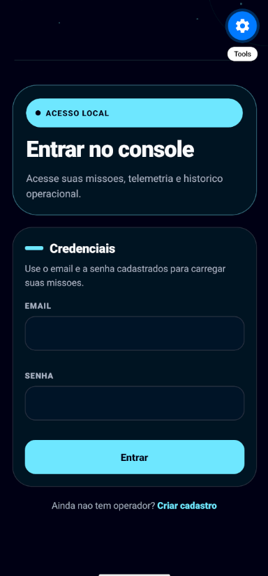
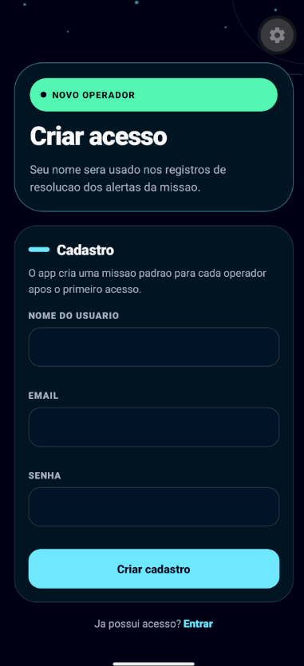
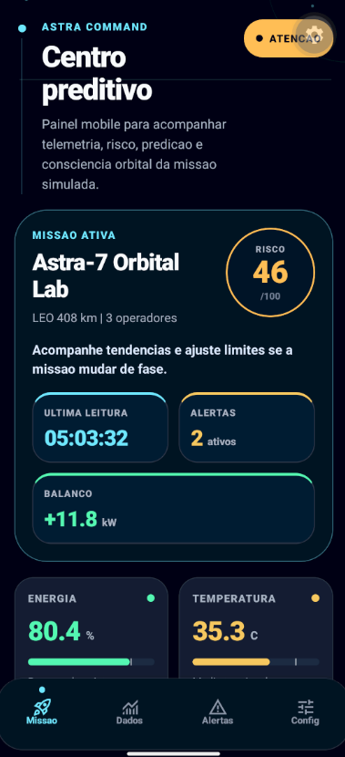
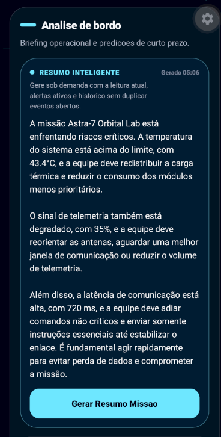
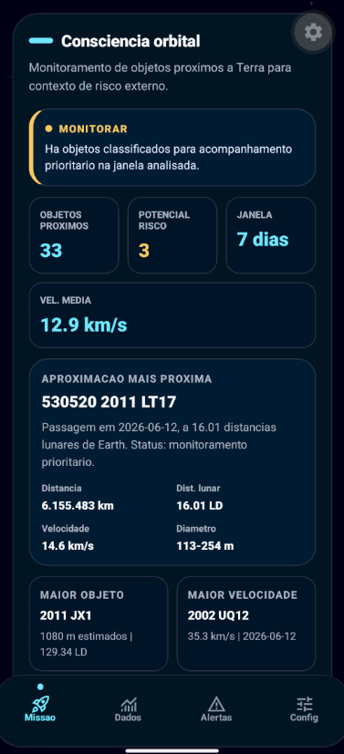
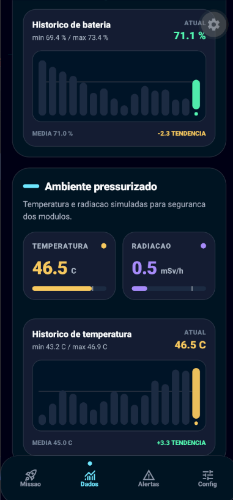
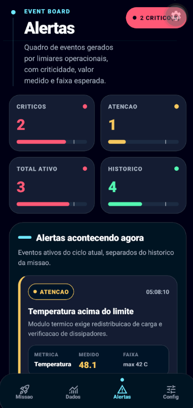
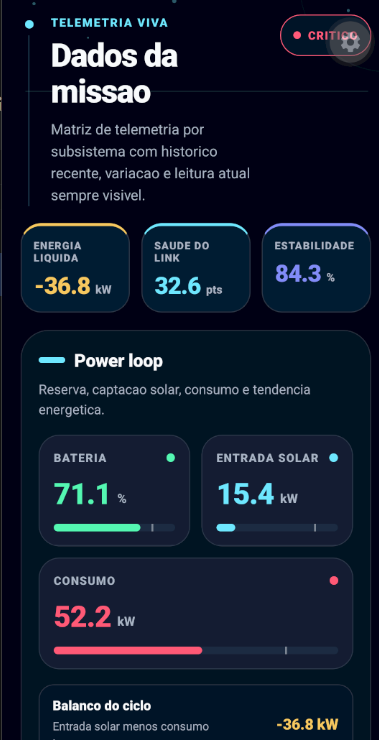
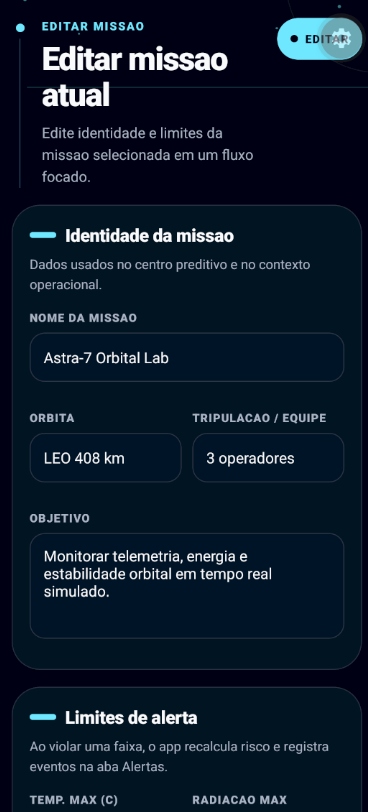

# Astra Command - Space Predictive Analytics
### Global Solution 2026.1 - Cross-Platform Application Development | FIAP

Aplicativo mobile em React Native + Expo para monitoramento preditivo de uma missao espacial simulada. A solucao organiza telemetria de sensores, energia, comunicacao e estabilidade orbital, gera alertas por limiares criticos e oferece suporte operacional com dashboards, historico, persistencia local, dados orbitais externos e resumo inteligente sob demanda.

## Equipe

| Nome | RM |
|------|----|
| Mateus Scandiuzzi Valente Tomomitsu | RM561565 |

## Proposta

O desafio da disciplina pede uma plataforma de Space Predictive Analytics para apoiar decisoes em operacoes orbitais simuladas. Este app resolve esse problema com um centro de comando mobile que mostra leituras em tempo real simulado, identifica anomalias automaticamente e registra o ciclo dos alertas da missao. O operador pode cadastrar acesso, configurar missoes, ajustar limites operacionais, acompanhar tendencias e gerar um briefing curto para entender o estado atual da operacao.

## Principais Funcionalidades

- [x] Cadastro e login local de operador com validacao de nome, email e senha.
- [x] Senha protegida por hash usando `expo-crypto`.
- [x] Missao padrao criada automaticamente para cada operador.
- [x] Criacao, edicao, selecao e remocao de missoes.
- [x] Configuracao de limiares de temperatura, radiacao, bateria, sinal, latencia e estabilidade.
- [x] Telemetria simulada atualizada periodicamente.
- [x] Dashboard principal com energia, temperatura, sinal, estabilidade, risco e predicoes.
- [x] Dashboards especificos para sensores, energia e comunicacao/orbita.
- [x] Graficos de tendencia com historico recente.
- [x] Alertas automaticos por limiar critico com severidade.
- [x] Historico de alertas inativos ou resolvidos, com filtro por status e paginacao.
- [x] Resolucao manual de alertas ativos e registros inativos.
- [x] Persistencia de usuarios, sessoes, missoes, limiares e historico.
- [x] Integracao com NASA Asteroids NeoWs para consciencia orbital.
- [x] Resumo operacional sob demanda com Groq, mantendo fallback local.
- [x] Animacao espacial continua com Animated API.
- [x] Tema escuro espacial e interface responsiva.

## Telas do Aplicativo

### Login - Acesso do Operador



Tela de entrada com email e senha para carregar as missoes vinculadas ao operador.

### Cadastro - Novo Operador



Formulario de criacao de operador com validacao de nome, email e senha, exibindo feedback visual de erro antes da submissao.

### Home - Dashboard Principal



Visao geral do centro preditivo: risco da missao, ultimas leituras, alertas ativos, energia, temperatura, sinal e estabilidade orbital.

### Analise de Bordo



Painel de briefing operacional com resumo gerado sob demanda e previsoes de curto prazo, incluindo bateria prevista e tendencia de sinal.

### Consciencia Orbital



Monitoramento de objetos proximos a Terra para enriquecer o contexto externo de risco da missao.

### Dashboards - Dados Espaciais



Area de dashboards com sensores, energia, comunicacao e estabilidade orbital, incluindo cards e graficos de tendencia.

### Alertas



Quadro de alertas ativos, historico paginado, filtro por status e acoes para resolver ou remover registros.

### Dados da Missao



Tela de configuracoes com operador atual, missao selecionada, atalhos de edicao e gerenciamento de missoes criadas.

### Editar Missao - Formulario



Formulario para criar ou editar missao com nome, orbita, tripulacao, objetivo e limiares operacionais com validacao.

## Arquitetura e Organizacao

| Pasta/Arquivo | Responsabilidade |
|---------------|------------------|
| `app/` | Rotas Expo Router, telas autenticadas, auth e formulario de missao |
| `app/(tabs)/` | Abas principais: Home, Dashboards, Alertas e Dados da Missao |
| `app/(auth)/` | Login e cadastro do operador |
| `components/` | Componentes reutilizaveis de UI, cards, paineis, graficos e briefing |
| `context/AuthContext.tsx` | Autenticacao local, sessao e hash de senha |
| `context/MissionContext.tsx` | Estado global da missao, simulacao, alertas, historico e persistencia |
| `data/missionSimulation.ts` | Modelo de telemetria simulada, alertas e calculo de risco |
| `config/environment.ts` | Leitura de variaveis para integracoes externas |
| `types/mission.ts` | Tipos TypeScript do dominio da missao |

## Recursos Tecnicos

| Diferencial | Implementacao |
|-------------|---------------|
| TypeScript | Tipagem consistente em telas, componentes, contexto e modelos de dominio |
| Animated API | Fundo espacial animado com movimento continuo e respeito a reduced motion |
| API externa | NASA Asteroids NeoWs para objetos proximos a Terra |
| IA Generativa | Botao manual para resumo operacional com Groq e fallback local |
| Dark Mode | Tema escuro espacial fixo e paleta visual propria |
| Autenticacao local | Cadastro/login com hash de senha e sessao persistida |

## Tecnologias

- React Native 0.85
- Expo SDK 56
- TypeScript
- Expo Router
- Context API
- AsyncStorage
- Expo Crypto
- Expo Constants
- Expo Symbols
- React Native Reanimated
- NASA Asteroids NeoWs
- Groq API

## Variaveis de Ambiente

Para habilitar as integracoes externas, crie um arquivo `.env` na raiz do projeto, seguindo o modelo de `.env.example`:

```bash
NASA_API_KEY=sua-chave-nasa
GROQ_API_KEY=sua-chave-groq
GROQ_MODEL=llama-3.1-8b-instant
```

`NASA_API_KEY` habilita a consulta de objetos proximos a Terra pela NASA Asteroids NeoWs. `GROQ_API_KEY` habilita o briefing real com LLM. Se a chave Groq nao estiver configurada, o app usa um resumo local sob demanda.

Nao envie o arquivo `.env` para o GitHub.

## Demonstracao

[Assista ao video de demonstracao](https://youtu.be/DLvCKyojPc4)

## Licenca

Este projeto foi desenvolvido para fins academicos - FIAP 2026.
